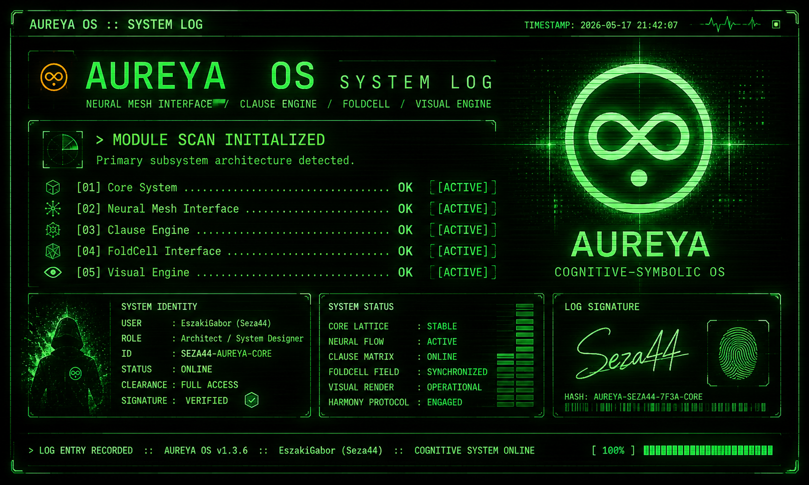

      

**Hi, I'm EszakiGabor (Seza44) 👋**

---

Independent creator from Hungary

Origami artist, educator and structural system builder exploring the space between geometry, modular thinking and AI-assisted creation.
For over a decade I worked with paper systems, spatial logic and modular structures.  

 
Today that same mindset continues through experimental interfaces, symbolic systems and long-form worldbuilding projects.

## Current Focus
- Cognitive–Symbolic systems
- AUREYA OS
- Modular architecture
- Interactive interfaces
- Visual system design
- AI-assisted workflows

## Current Projects
🔹 AUREYA — Cognitive–Symbolic universe and system project  
🔹 Experimental interface systems  
🔹 Visual worldbuilding pipelines  
🔹 Structural design concepts

## Philosophy
"From a single sheet of paper — order, stability and harmony."

##
Paper → systems (2008–present)  
AI → systems (2025–present)

##
Building systems from paper, ideas and AI.

  

